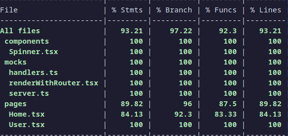
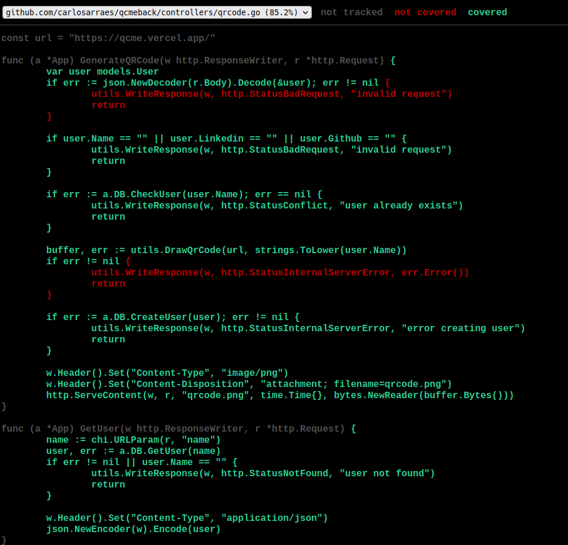
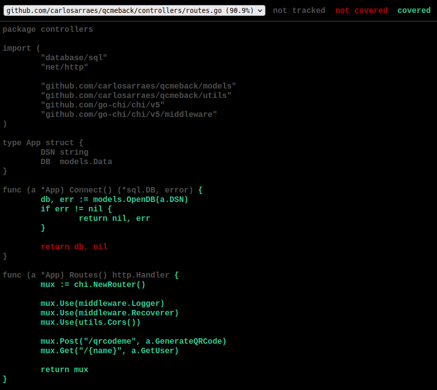

# QrCode Me

QrCode Me is an app designed to easily share your GitHub or LinkedIn profiles. Simply fill out the provided forms and save the generated QR code for quick and easy sharing! You can check the app in this [link](https://qcme.vercel.app/).

## Frontend

The frontend is built using React with TypeScript, and it's deployed on Vercel. The app incorporates react-icons and react-toastify packages, and is styled with Tailwind CSS. There are only two routes: the home page and the user profile page. When a user fills out the form, their information is saved to the database. Upon accessing the user's unique URL, the backend queries the database based on the URL parameter, searches for the user, and if found, sends the data back to the frontend to be displayed.

## Backend

The backend is a stateless API container hosted on Google Cloud Run, written in Golang. Its main functions are generating QR codes (without saving them), writing data to the database, and sending the data to the frontend. There are only two endpoints: one for creating the QR code and saving data to the database (/qrcodeme), and another for retrieving data from the database (/:name).

```Dockerfile
FROM golang:1.20.1-alpine3.17

WORKDIR /usr/src/app

COPY go.mod go.sum ./
RUN go mod download && go mod verify

COPY . .
RUN go build -o ./out/dist .

EXPOSE 8080

CMD ./out/dist
```

## Database

The database is a PostgreSQL container hosted on ElephantSQL. The table was initialized after the first run of the backend.

```sql
CREATE SCHEMA IF NOT EXISTS data;

CREATE TABLE data.qrcode (
    id SERIAL PRIMARY KEY,
    name VARCHAR(255) NOT NULL,
    linkedin VARCHAR(512),
    github VARCHAR(512)
);
```

## Tests

### Front End

#### Tests done with Vitest, MSW for mocking.

<div align="center">

</div>

### Back End

### Tests done with native Golang, no packages.

<table align="center">
<thead>
<tr>
<th align="center">
Controllers
</th>
<th align="center">
Routes
</th>
</tr>
</thead>
<tbody>
<tr>
<td>

</td>
<td>

</td>
</tr>
</tbody>
</table>